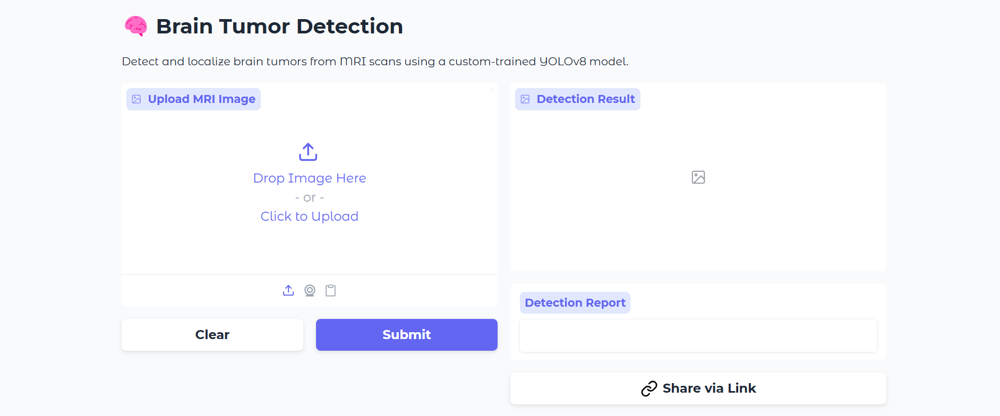

## 🧠 Brain Tumor Detection and Classification Based on MRI Brain Scan

Proyek ini bertujuan untuk mendeteksi dan mengklasifikasikan tipe tumor otak dari gambar MRI menggunakan pendekatan deep learning. Data dilabeli menggunakan format YOLO, dan digunakan untuk dua task utama:

- **Deteksi lokasi tumor otak**
- **Klasifikasi jenis tumor**: Glioma, Meningioma, Pituitary, atau No Tumor

### 🔍 Tampilan Aplikasi
[](https://huggingface.co/spaces/cashewwww/Brain-Tumor)

---
### 📁 Struktur Dataset

Link Dataset: (https://www.kaggle.com/datasets/ahmedsorour1/mri-for-brain-tumor-with-bounding-boxes)
Dataset disusun ulang dalam struktur berikut:

```
MRI-Brain-Tumor-Bounding-Boxes/
├── Train/
│   ├── Glioma/
│   │   ├── images/
│   │   └── labels/
│   ├── Meningioma/
│   ├── Pituitary/
│   └── No Tumor/
├── Val/
    └── ...
```

Setiap kelas memiliki folder `images/` dan `labels/` (format YOLO `.txt`).

---

### 🚀 Fitur Notebook
Notebook melakukan:

1. **Eksplorasi dan persiapan data**
   - Membaca struktur folder dengan fungsi `train_df()` dan `test_df()`
   - Membuat DataFrame dari path gambar dan label
2. **Visualisasi jumlah data per kelas**
   - Menggunakan Seaborn untuk menghitung jumlah gambar per tipe tumor
3. **Preprocessing data**
   - Menggunakan `ImageDataGenerator` untuk augmentasi dan rescale
---

### 🧪 Teknologi
- Python
- TensorFlow & Keras
- Seaborn, Matplotlib
- PIL, NumPy, Pandas
- Format label YOLO

---
